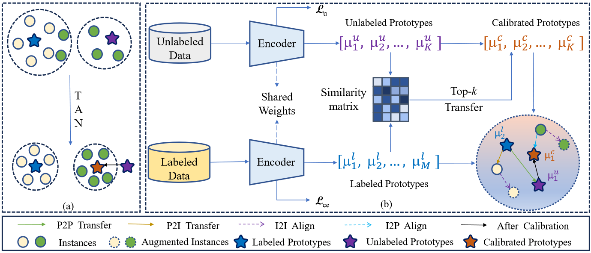
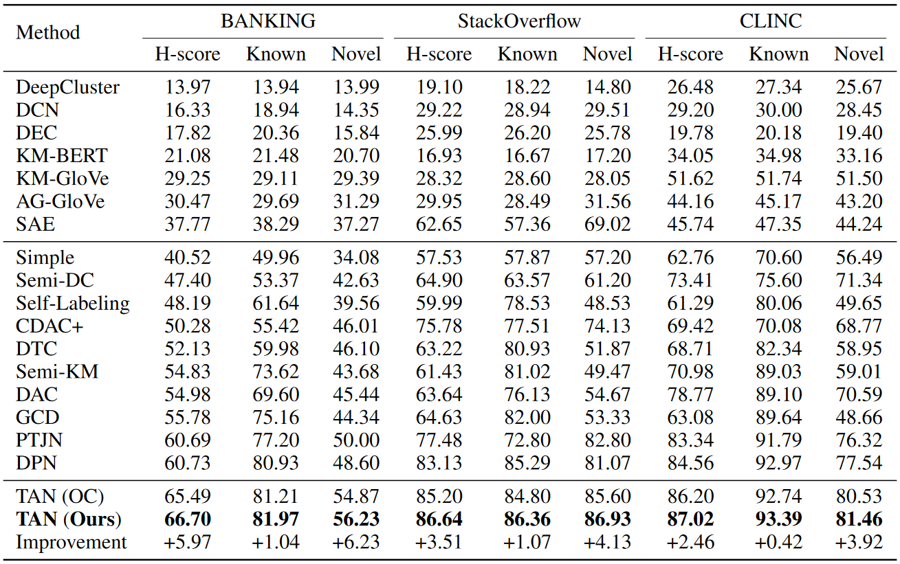

# Transfer and Alignment Network (TAN)
Data and code for paper titled [Transfer and Alignment Network for Generalized Category Discovery](https://arxiv.org/abs/2312.16467) (AAAI 2024 paper)

*Generalized Category Discovery (GCD)* is a crucial task that aims to recognize both known and novel categories from an unlabeled dataset by leveraging another labeled dataset with only known categories. In this paper, we propose a Transfer and Alignment Network (TAN), which incorporates two knowledge transfer mechanisms (Prototype-to-Prototype Transfer and Prototype-to-Instance Transfer) to calibrate the biased knowledge and two feature alignment mechanisms (Instance-to-Prototype Alignment and Instance-to-Instance Alignment) to learn discriminative features.


## Contents
[1. Data](#data)

[2. Model](#model)

[3. Requirements](#requirements)

[4. Running](#running)

[5. Results](#results)

[6. Thanks](#thanks)

[7. Citation](#citation)

## Data
We performed experiments on three public datasets: [clinc](https://aclanthology.org/D19-1131/), [banking](https://aclanthology.org/2020.nlp4convai-1.5/) and [stackoverflow](https://aclanthology.org/W15-1509/), which have been included in our repository in the data folder ' ./data '.

## Model
An overview of our model is shown in the figure.
<div align=center>

</div>

## Requirements
* python==3.8
* pytorch==1.11.0
* transformers==4.19.2
* scipy==1.8.0
* numpy==1.21.6
* scikit-learn==1.1.1
* pytorch-pretrained-bert==0.6.2

## Running
Pre-training, training and testing our model through the bash scripts:
```
sh run.sh
```
You can also add or change parameters in run.sh (More parameters are listed in init_parameter.py)

## Results
<div align=center>

</div>
It should be noted that the experimental results may be different because of the randomness of clustering when testing even though we fixed the random seeds.

## Thanks
Some code references the following repositories:
* [DPN](https://github.com/Lackel/DPN)
* [DeepAligned](https://github.com/thuiar/DeepAligned-Clustering)

## Citation
If our paper or code is helpful to you, please consider citing our paper:
```
@inproceedings{an2024transfer,
  title={Transfer and alignment network for generalized category discovery},
  author={An, Wenbin and Tian, Feng and Shi, Wenkai and Chen, Yan and Wu, Yaqiang and Wang, Qianying and Chen, Ping},
  booktitle={Proceedings of the AAAI Conference on Artificial Intelligence},
  volume={38},
  number={10},
  pages={10856--10864},
  year={2024}
}
```
